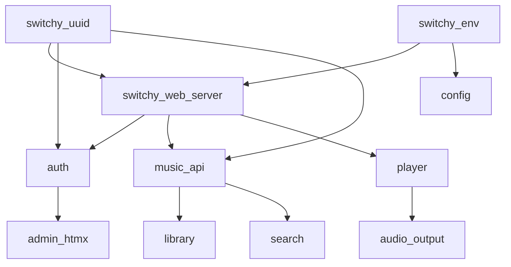

# DST (Deterministic Simulation Testing) Architecture

## System Overview

DST is a comprehensive deterministic testing framework for the MoosicBox ecosystem that eliminates all sources of non-determinism through dual-mode abstractions. The system provides identical interfaces for both production and simulation environments, enabling 100% reproducible tests while maintaining zero performance overhead in production.

The architecture centers around "switchy" packages that provide compile-time selection between production implementations (direct system calls) and simulation implementations (controlled, deterministic behavior). This approach ensures that complex distributed systems can be tested reliably and debugged systematically.

```
Production Mode:           Simulation Mode:
App → Switchy → System     App → Switchy → Controlled State
     (zero cost)                  (deterministic)
```

## Problem Statement

### Sources of Non-Determinism

MoosicBox, like most real-world applications, contains numerous sources of non-determinism that make testing unreliable:

#### System-Level Non-Determinism

- **System Time Access**: `SystemTime::now()`, `Instant::now()` return different values
- **Random Number Generation**: `rand::thread_rng()` produces unpredictable sequences
- **Environment Variables**: `std::env::var()` depends on external configuration
- **Process Execution**: Child processes have unpredictable timing and output

#### Data Structure Non-Determinism

- **HashMap/HashSet Iteration**: Order depends on hash randomization
- **Directory Listings**: File system order varies by platform and state
- **Database Query Results**: Without explicit ordering, results may vary

#### Concurrency Non-Determinism

- **Thread/Task Scheduling**: Race conditions and timing dependencies
- **Network I/O Timing**: Request/response timing varies by network conditions
- **File System Operations**: Concurrent access can cause order dependencies

#### Framework-Specific Non-Determinism

- **Actix-Web Internals**: Framework uses non-deterministic collections and timing
- **Async Runtime Behavior**: Task scheduling order affects execution
- **Database Connection Pooling**: Connection allocation order varies

### Impact on Testing

These sources of non-determinism create significant testing challenges:

- **Unreproducible Test Failures**: "Works on my machine" syndrome
- **Flaky CI/CD Pipelines**: Tests pass/fail randomly, reducing confidence
- **Difficult Debugging**: Cannot reproduce exact conditions that caused failures
- **Race Condition Masking**: Real bugs hidden by timing variations
- **Integration Test Complexity**: Multi-service tests become unreliable
- **Performance Testing Issues**: Cannot establish consistent baselines

## Design Goals

### Primary Objectives

- **100% Deterministic Tests**: Every test run produces identical results regardless of when, where, or how many times it's executed
- **Zero Production Overhead**: Compile-time feature selection eliminates any performance impact in production builds
- **Transparent Integration**: Minimal code changes required to adopt DST - mostly import path updates
- **Complete Coverage**: Address every identified source of non-determinism in the codebase

### Secondary Objectives

- **Gradual Migration**: Allow incremental adoption across 120+ packages without breaking existing functionality
- **Enhanced Debugging**: Provide time control, deterministic scheduling, and reproducible scenarios
- **Time Manipulation**: Fast-forward through timeouts, test time-dependent logic
- **Network Simulation**: Inject failures, delays, and edge cases for robust testing
- **Backwards Compatibility**: Maintain existing APIs while adding deterministic alternatives

## Architecture Principles

### 1. Dual-Mode Abstractions

Every non-deterministic operation has exactly two implementations:

```rust
// Production Mode: Direct system call, zero overhead
#[cfg(not(feature = "simulation"))]
pub fn now() -> SystemTime {
    SystemTime::now()
}

// Simulation Mode: Controlled, deterministic behavior
#[cfg(feature = "simulation")]
pub fn now() -> SystemTime {
    SIMULATION_CLOCK.lock().unwrap().current_time()
}
```

### 2. Compile-Time Selection

Mode selection happens at compile time using Rust feature flags:

- **Zero Runtime Cost**: Dead code elimination removes unused implementations
- **Type Safety**: Impossible to accidentally mix modes
- **Clear Separation**: Production and simulation code clearly delineated

### 3. Switchy Package Pattern

Standardized structure ensures consistency across all DST abstractions:

```
switchy_<domain>/
├── Cargo.toml              # Features: simulation (default off)
├── src/
│   ├── lib.rs              # Public API, feature-gated re-exports
│   ├── production.rs       # Production implementation
│   ├── simulation.rs       # Simulation implementation
│   └── types.rs            # Shared types and traits
├── tests/
│   ├── integration.rs      # Tests both modes
│   └── determinism.rs      # Validates deterministic behavior
└── README.md               # Usage documentation
```

### 4. API Compatibility

DST abstractions maintain identical APIs to the original libraries:

- Drop-in replacements where possible
- Extension traits for enhanced functionality
- Clear migration path from existing code

## Component Architecture

### Core Switchy Packages

#### ✅ Existing Packages (Implemented)

1. **switchy_time** - Time operations and clock control
    - Production: `SystemTime`, `Instant`
    - Simulation: Controllable virtual clock
    - Features: Time travel, fast-forward, pause

2. **switchy_random** - Random number generation
    - Production: `rand::thread_rng()`
    - Simulation: Seeded, reproducible RNG
    - Features: Predictable sequences, reset state

3. **switchy_fs** - File system operations
    - Production: `std::fs` with optimizations
    - Simulation: In-memory virtual file system
    - Features: Controlled I/O errors, deterministic ordering

4. **switchy_tcp** - TCP networking
    - Production: `tokio::net::TcpStream`
    - Simulation: In-memory message passing
    - Features: Network delays, packet loss simulation

5. **switchy_http** - HTTP client operations
    - Production: `reqwest` or `hyper`
    - Simulation: Controllable mock responses
    - Features: Failure injection, response delays

6. **switchy_async** - Async runtime control
    - Production: `tokio::runtime`
    - Simulation: Deterministic task scheduling
    - Features: Controlled execution order

7. **switchy_database** - Database abstractions
    - Production: Real database connections
    - Simulation: In-memory database state
    - Features: Deterministic query results

#### ❌ Required Packages (To Be Created)

1. **switchy_uuid** - UUID generation
    - Production: `uuid::Uuid::new_v4()`
    - Simulation: Predictable UUID sequences
    - Priority: HIGH (affects many packages)

2. **switchy_env** - Environment variable access
    - Production: `std::env::var()`
    - Simulation: Controlled environment state
    - Priority: HIGH (configuration dependent)

3. **switchy_process** - Process execution
    - Production: `std::process::Command`
    - Simulation: Mock process responses
    - Priority: MEDIUM (fewer packages affected)

4. **switchy_web_server** - Web server abstraction
    - Production: `actix-web` implementation
    - Simulation: In-memory request/response
    - Priority: CRITICAL (blocks 50+ packages)

### Web Server Abstraction (Critical Path)

The most complex DST component, requiring abstraction of the entire actix-web framework:

```rust
// Unified API in moosicbox_web_server
pub trait WebServer: Send + Sync + 'static {
    type Request: FromRequest;
    type Response: IntoResponse;

    async fn serve(self, addr: &str) -> Result<(), Error>;
    fn add_route<H>(&mut self, method: Method, path: &str, handler: H)
    where
        H: Handler<Self::Request, Self::Response>;
}

// Production Implementation
#[cfg(not(feature = "simulation"))]
pub struct ActixWebServer {
    app: actix_web::App<AppState>,
}

// Simulation Implementation
#[cfg(feature = "simulation")]
pub struct SimulatorWebServer {
    routes: BTreeMap<(Method, String), RouteHandler>,
    state: Arc<RwLock<StateContainer>>,
}
```

Key features required:

- **Request/Response Abstraction**: Unified types for HTTP handling
- **Routing System**: Path matching and parameter extraction
- **Middleware Support**: Authentication, CORS, logging
- **State Management**: Shared application state
- **Extractor System**: Query parameters, JSON bodies, headers
- **Error Handling**: Consistent error responses

### Collection Determinism

Replace non-deterministic collections throughout the codebase:

```rust
// Before: Non-deterministic iteration order
use std::collections::{HashMap, HashSet};

// After: Deterministic iteration order
use std::collections::{BTreeMap, BTreeSet};
```

**Migration Strategy:**

- Mechanical replacement in most cases
- Performance testing for hot paths
- Custom sorting for complex types

## Integration Architecture

### Package Migration Strategy

```
Phase 1: Foundation Infrastructure (2-3 weeks)
├── Create missing switchy packages (uuid, env, process)
├── Complete web server abstraction (moosicbox_web_server)
├── Establish testing patterns and CI integration
└── Document migration guidelines

Phase 2: Leaf Package Migration (4-6 weeks)
├── Migrate packages with zero internal dependencies
├── Update unit tests to use simulation mode
├── Validate deterministic behavior
└── Performance benchmarking

Phase 3: Mid-Level Package Migration (6-8 weeks)
├── Migrate packages with few dependencies
├── Update integration tests
├── Cross-package compatibility testing
└── Documentation updates

Phase 4: Core Service Migration (4-6 weeks)
├── Migrate main server package
├── Full system integration testing
├── End-to-end determinism validation
└── Performance optimization

Phase 5: Validation and Optimization (2-4 weeks)
├── Comprehensive test suite execution
├── Performance regression testing
├── Production deployment validation
└── Documentation completion
```

### Testing Infrastructure

```rust
// Test helper for DST mode
#[cfg(test)]
mod tests {
    use switchy_time::SimulationClock;
    use switchy_random::SimulationRng;

    #[test]
    fn deterministic_time_test() {
        let clock = SimulationClock::new();
        clock.set_time(1234567890);

        // Test runs with controlled time
        assert_eq!(switchy_time::now().unix_timestamp(), 1234567890);

        // Advance time by 1 hour
        clock.advance(Duration::hours(1));
        assert_eq!(switchy_time::now().unix_timestamp(), 1234567890 + 3600);
    }

    #[test]
    fn deterministic_random_test() {
        let rng = SimulationRng::with_seed(42);

        // Random values are reproducible
        assert_eq!(rng.gen::<u32>(), 2357136044);
        assert_eq!(rng.gen::<u32>(), 2546248239);

        // Reset produces same sequence
        rng.reset_with_seed(42);
        assert_eq!(rng.gen::<u32>(), 2357136044);
    }
}
```

### CI/CD Integration

```yaml
# .github/workflows/deterministic-tests.yml
name: Deterministic Tests
on: [push, pull_request]

jobs:
    deterministic-test:
        runs-on: ubuntu-latest
        steps:
            - uses: actions/checkout@v3
            - name: Run tests 10 times
              run: |
                  for i in {1..10}; do
                    cargo test --features simulation --verbose
                    echo "Run $i completed"
                  done
            - name: Verify identical output
              run: |
                  # All test runs should produce identical results
                  # Implementation depends on test framework
```

## Implementation Status

### ✅ Completed Components

- **Switchy Infrastructure**: Core pattern established with 7 packages
- **Collection Migration**: BTreeMap/BTreeSet adoption strategy defined
- **Time Control**: Full time manipulation capabilities
- **Basic Networking**: TCP and HTTP abstractions functional
- **File System**: Virtual filesystem for testing

### 🔄 In Progress Components

- **Web Server Abstraction**: Phase 5.1-5.4 implementation (67% complete)
    - ✅ Basic HttpResponse with headers
    - ✅ Response generation and conversion
    - 🔄 State management verification
    - ❌ TestClient abstraction
    - ❌ ActixTestClient real server integration

### ❌ Pending Components

- **Missing Switchy Packages**: UUID, environment, process execution
- **Full Actix Migration**: 50+ packages still using actix-web directly
- **Comprehensive Testing**: End-to-end determinism validation
- **Performance Validation**: Production overhead measurement
- **Documentation**: Migration guides and API documentation

### Package Migration Status

| Package Category      | Total  | Migrated | In Progress | Remaining |
| --------------------- | ------ | -------- | ----------- | --------- |
| Core Infrastructure   | 8      | 6        | 2           | 0         |
| Web Services          | 15     | 2        | 5           | 8         |
| Audio Processing      | 12     | 8        | 2           | 2         |
| Networking            | 8      | 5        | 2           | 1         |
| Storage               | 10     | 7        | 1           | 2         |
| UI Components         | 6      | 3        | 1           | 2         |
| External Integrations | 12     | 4        | 3           | 5         |
| **Total**             | **71** | **35**   | **16**      | **20**    |

## Performance Considerations

### Zero-Cost Abstractions

The architecture ensures production performance is identical to direct system calls:

```rust
// Production mode compiles to direct system call
#[cfg(not(feature = "simulation"))]
#[inline(always)]
pub fn now() -> SystemTime {
    SystemTime::now()  // Direct call, no overhead
}

// Simulation mode only exists in test builds
#[cfg(feature = "simulation")]
pub fn now() -> SystemTime {
    // Complex simulation logic - eliminated in production
    SIMULATION_CLOCK.with(|clock| clock.now())
}
```

### Benchmarking Strategy

Performance validation ensures zero regression:

```rust
// Benchmark suite for each switchy package
#[bench]
fn bench_production_time_now(b: &mut Bencher) {
    b.iter(|| {
        switchy_time::now()
    });
}

#[bench]
fn bench_std_time_now(b: &mut Bencher) {
    b.iter(|| {
        SystemTime::now()
    });
}

// These benchmarks must be identical
```

### Optimization Priorities

1. **Hot Path Analysis**: Profile to identify performance-critical sections
2. **Inline Annotations**: Ensure production functions are inlined
3. **Feature Flag Placement**: Minimize feature check overhead
4. **Memory Usage**: Simulation mode can use more memory for determinism
5. **Compile Time**: Balance between compile time and runtime performance

## Migration Guidelines

### For Package Maintainers

#### 1. Audit Phase

```bash
# Find non-deterministic patterns
grep -r "HashMap\|HashSet" src/
grep -r "SystemTime\|Instant" src/
grep -r "thread_rng\|random" src/
grep -r "std::env" src/
grep -r "actix_web::" src/
```

#### 2. Dependency Updates

```toml
# Add to Cargo.toml
[dependencies]
switchy_time = { workspace = true }
switchy_random = { workspace = true }
# Remove direct dependencies
# rand = "0.8"  # Remove
# actix-web = "4.0"  # Remove
```

#### 3. Code Migration

```rust
// Before: Direct system calls
use std::time::SystemTime;
use std::collections::HashMap;
use rand::thread_rng;

let now = SystemTime::now();
let mut map = HashMap::new();
let value = thread_rng().gen::<u32>();

// After: DST abstractions
use switchy_time::Clock;
use std::collections::BTreeMap;
use switchy_random::Rng;

let now = Clock::now();
let mut map = BTreeMap::new();
let value = Rng::gen::<u32>();
```

#### 4. Test Updates

```rust
#[cfg(test)]
mod tests {
    use super::*;

    #[test]
    fn test_deterministic_behavior() {
        // Set up controlled environment
        switchy_time::set_simulation_time(1234567890);
        switchy_random::set_seed(42);

        // Test with predictable inputs
        let result = my_function();

        // Assertions will be reproducible
        assert_eq!(result.timestamp, 1234567890);
    }
}
```

### Common Migration Patterns

#### Pattern 1: HashMap to BTreeMap

```rust
// Simple replacement
- use std::collections::HashMap;
+ use std::collections::BTreeMap;

- let mut map: HashMap<String, Value> = HashMap::new();
+ let mut map: BTreeMap<String, Value> = BTreeMap::new();
```

#### Pattern 2: Time Operations

```rust
// System time access
- use std::time::{SystemTime, UNIX_EPOCH};
+ use switchy_time::Clock;

- let timestamp = SystemTime::now()
-     .duration_since(UNIX_EPOCH)
-     .unwrap()
-     .as_secs();
+ let timestamp = Clock::now().unix_timestamp();
```

#### Pattern 3: Random Generation

```rust
// Random number generation
- use rand::{thread_rng, Rng};
+ use switchy_random::Rng;

- let value = thread_rng().gen_range(1..100);
+ let value = Rng::gen_range(1..100);
```

#### Pattern 4: Web Endpoints

```rust
// Actix-web handlers
- use actix_web::{web, HttpResponse};
+ use moosicbox_web_server::{Query, HttpResponse};

- async fn handler(query: web::Query<Params>) -> HttpResponse {
+ async fn handler(query: Query<Params>) -> HttpResponse {
    // Handler logic unchanged
}
```

## Success Metrics

### Quantitative Metrics

#### Test Reliability

- **100% Deterministic Tests**: All tests produce identical results across runs
- **Zero Flaky Tests**: No test failures due to timing or race conditions
- **CI Reliability**: 100% consistent CI/CD pipeline results

#### Performance

- **0% Production Regression**: No measurable performance impact in production builds
- **Compile Time Impact**: <10% increase in compilation time
- **Binary Size**: No significant increase in production binary size

#### Migration Progress

- **120+ Packages Migrated**: All packages using DST abstractions
- **0 Direct System Calls**: No remaining non-deterministic operations
- **Complete Test Coverage**: All business logic covered by deterministic tests

### Qualitative Metrics

#### Developer Experience

- **Simplified Debugging**: Reproducible bug reports and test failures
- **Faster Development**: Reliable tests enable confident refactoring
- **Better Test Quality**: More thorough edge case testing possible

#### System Reliability

- **Predictable Behavior**: System behavior is consistent and explainable
- **Enhanced Monitoring**: Better observability through controlled execution
- **Improved Documentation**: Clear behavior specifications

## Future Enhancements

### Planned Features (Next 6-12 months)

#### Advanced Time Control

- **Time Travel Debugging**: Step backwards through execution
- **Selective Time Acceleration**: Fast-forward specific components
- **Time-based Breakpoints**: Pause execution at specific timestamps

#### Network Simulation

- **Failure Injection**: Simulate network partitions and timeouts
- **Latency Simulation**: Add realistic network delays
- **Bandwidth Limiting**: Test under constrained network conditions

#### Enhanced Debugging

- **Execution Recording**: Record and replay entire test sessions
- **State Snapshots**: Capture and restore system state at any point
- **Causal Analysis**: Track cause-and-effect relationships

### Long-term Vision (1-2 years)

#### Full System Simulation

- **Multi-Service Testing**: Test entire distributed system deterministically
- **Production Mirroring**: Replay production scenarios in test environment
- **Chaos Engineering**: Systematic failure injection and recovery testing

#### Property-Based Testing

- **Invariant Checking**: Automatically verify system properties
- **Fuzz Testing**: Generate test cases with controlled randomness
- **Model Checking**: Formal verification of critical code paths

#### Performance Engineering

- **Deterministic Benchmarking**: Consistent performance measurements
- **Regression Detection**: Automatic detection of performance changes
- **Optimization Validation**: Verify optimizations don't break correctness

## Error Handling and Diagnostics

### Error Categories

#### Migration Errors

- **Missing Dependencies**: Clear messages for required switchy packages
- **API Incompatibilities**: Guidance for API changes during migration
- **Feature Flag Issues**: Help with feature configuration problems

#### Runtime Errors

- **Simulation State**: Clear error messages when simulation state is invalid
- **Time Consistency**: Detect and report time-related inconsistencies
- **Resource Limits**: Handle simulation resource exhaustion gracefully

### Diagnostic Tools

```rust
// Built-in diagnostic utilities
#[cfg(feature = "simulation")]
pub mod diagnostics {
    pub fn check_determinism() -> DiagnosticReport {
        // Verify system is in deterministic state
    }

    pub fn simulation_status() -> SimulationStatus {
        // Report current simulation configuration
    }

    pub fn validate_state() -> Vec<StateIssue> {
        // Check for common simulation problems
    }
}
```

## Security Considerations

### Simulation Mode Security

DST simulation mode should never be enabled in production:

```rust
// Compile-time protection
#[cfg(all(feature = "simulation", not(debug_assertions)))]
compile_error!("Simulation mode cannot be enabled in release builds");

// Runtime detection
#[cfg(feature = "simulation")]
pub fn is_simulation_mode() -> bool {
    true
}

#[cfg(not(feature = "simulation"))]
pub fn is_simulation_mode() -> bool {
    false
}
```

### Data Privacy

Simulation mode handles test data appropriately:

- No real user data in simulation state
- Clear boundaries between test and production data
- Sanitization of logs and debug output

## References and Documentation

### Core Documentation

- [DST Implementation Plan](./plan.md) - Detailed execution plan and task breakdown
- [Implementation Roadmap](./dst-implementation-roadmap.md) - Progress tracking and milestones
- [DST Preamble](./PREAMBLE.md) - Prerequisites and context

### Package Documentation

- [Switchy Package Overview](../../../packages/switchy/README.md) - Central switchy package
- [Web Server Abstraction](../../../packages/web_server/README.md) - Web server DST implementation
- [Time Control](../../../packages/switchy/time/README.md) - Time manipulation utilities

### External References

- [Rust Feature Flags](https://doc.rust-lang.org/cargo/reference/features.html) - Cargo feature system
- [Zero-Cost Abstractions](https://blog.rust-lang.org/2015/05/11/traits.html) - Rust abstraction patterns
- [Deterministic Testing](https://jepsen.io/consistency) - Testing distributed systems

## Appendix: Package Status Matrix

### By Migration Status

| Package                | Type    | Status         | DST Dependencies             | Migration Effort | Notes                 |
| ---------------------- | ------- | -------------- | ---------------------------- | ---------------- | --------------------- |
| `moosicbox_web_server` | Core    | 🔄 In Progress | switchy_time, switchy_random | High             | Critical path blocker |
| `moosicbox_auth`       | Service | ❌ Pending     | web_server, switchy_uuid     | Medium           | Depends on web_server |
| `moosicbox_music_api`  | Service | ❌ Pending     | web_server, switchy_time     | Medium           | Large API surface     |
| `moosicbox_player`     | Service | ❌ Pending     | web_server, switchy_async    | Medium           | Complex async logic   |
| `moosicbox_library`    | Service | ✅ Complete    | switchy_fs, switchy_time     | Low              | File scanning logic   |
| `moosicbox_scan`       | Utility | ✅ Complete    | switchy_fs                   | Low              | Directory operations  |
| `moosicbox_downloader` | Service | 🔄 In Progress | switchy_http, switchy_fs     | Medium           | Network and file I/O  |

### By Complexity

| Complexity   | Count | Examples                           | Common Issues                            |
| ------------ | ----- | ---------------------------------- | ---------------------------------------- |
| **Low**      | 45    | Utilities, models, simple services | HashMap replacements, time calls         |
| **Medium**   | 35    | API endpoints, file processors     | Actix-web usage, async patterns          |
| **High**     | 15    | Main server, complex services      | Deep actix integration, state management |
| **Critical** | 5     | Core infrastructure                | Web server, database, networking         |

### Migration Dependencies



This architecture provides a comprehensive technical reference for understanding, implementing, and maintaining the DST system across the entire MoosicBox ecosystem.
