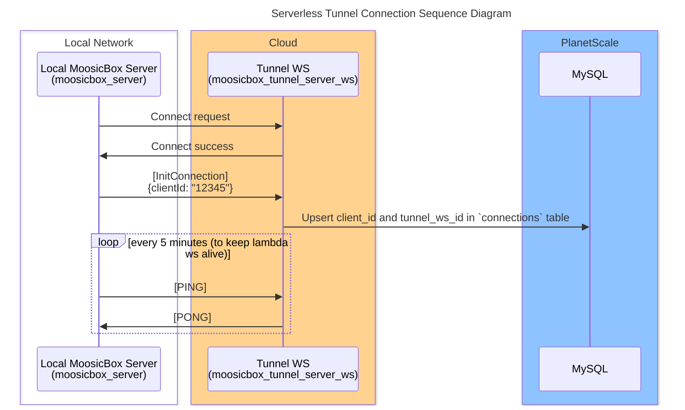
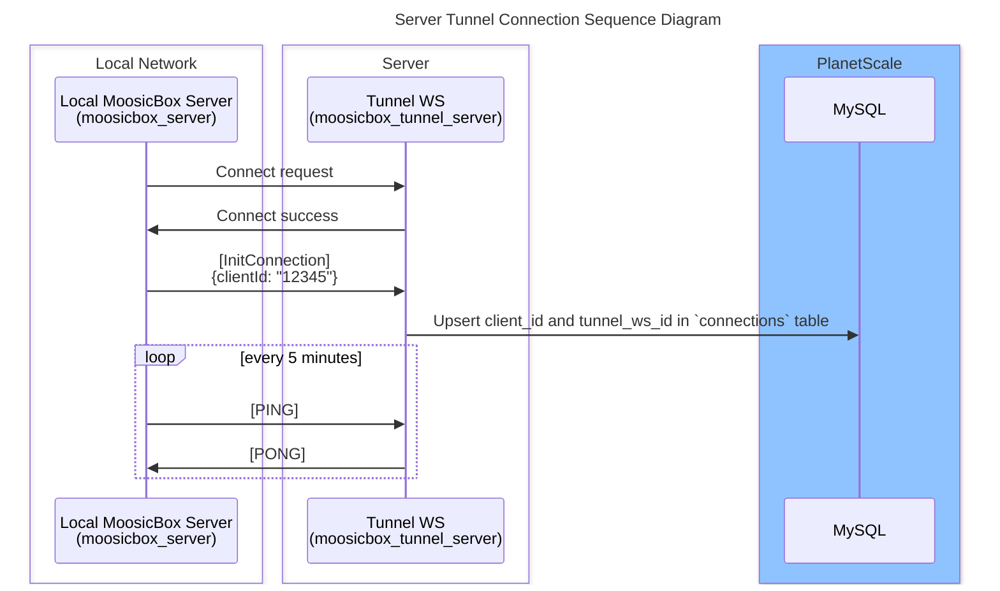

# Serverless

## Connection



## Data Stream Request

```mermaid
sequenceDiagram

title Serverless Tunnel Data Stream Request Sequence Diagram

box Internet
    actor Client
end

box rgb(255, 210, 143) Lambda
    participant API as Tunnel API<br>(moosicbox_tunnel_server)
end

box rgb(255, 210, 143) Lambda
    participant WS as Tunnel WS<br>(moosicbox_tunnel_server_ws)
end

box Local Network
    participant MoosicBox as Local MoosicBox Server<br>(moosicbox_server)
end

box rgb(143, 195, 255) PlanetScale
    participant MySQL
end

Client ->> API: Request data\n{clientId: "12345"}
API ->> WS: Request data\n{clientId: "12345"}
WS ->> MySQL: Request tunnel_ws_id for clientId "12345"
activate MySQL#gray
MySQL ->> WS: Return tunnel_ws_id "127347374123"
deactivate MySQL#gray
WS ->> MoosicBox: Request data from ws connection "127347374123"

loop until all data sent
    MoosicBox ->> MoosicBox: Read data (bytes)
    activate MoosicBox#gray
    MoosicBox ->> MoosicBox: Encode data (base64)
    deactivate MoosicBox#gray

    MoosicBox ->> WS: Send packet of data (base64)
    activate WS#gray
    deactivate WS#gray

    WS ->> API: Send packet of data (base64)
    activate API#gray
    deactivate API#gray
    API ->> API: Decode data (bytes)
    activate API#gray
    deactivate API#gray

    API ->> Client: Send packet of data (bytes)
    activate Client#gray
    deactivate Client#gray
end
```

## Data Blocking Request

```mermaid
sequenceDiagram

title Serverless Tunnel Data Blocking Request Sequence Diagram

box Internet
    actor Client
end

box rgb(255, 210, 143) Lambda
    participant API as Tunnel API<br>(moosicbox_tunnel_server)
end

box rgb(255, 210, 143) Lambda
    participant WS as Tunnel WS<br>(moosicbox_tunnel_server_ws)
end

box Local Network
    participant MoosicBox as Local MoosicBox Server<br>(moosicbox_server)
end

box rgb(143, 195, 255) PlanetScale
    participant MySQL
end

Client ->> API: Request data<br>{clientId: "12345"}
API ->> API: Create response buffer
activate API#gray
deactivate API#gray
API ->> WS: Request data<br>{clientId: "12345"}
WS ->> MySQL: Request tunnel_ws_id for clientId "12345"
activate MySQL#gray
MySQL ->> WS: Return tunnel_ws_id "127347374123"
deactivate MySQL#gray
WS ->> MoosicBox: Request data from ws connection "127347374123"

loop until all data sent
    MoosicBox ->> MoosicBox: Read data (bytes)
    activate MoosicBox#gray
    MoosicBox ->> MoosicBox: Encode data (base64)
    deactivate MoosicBox#gray

    MoosicBox ->> WS: Send packet of data (base64)
    activate WS#gray
    deactivate WS#gray

    WS ->> API: Send packet of data (base64)
    activate API#gray
    deactivate API#gray
    API ->> API: Decode data (bytes)
    activate API#gray
    deactivate API#gray
    API ->> API: Push bytes to response buffer
    activate API#gray
    deactivate API#gray
end

API ->> Client: Send response buffer (bytes)
activate Client#gray
deactivate Client#gray
```

# Server

## Connection



## Data Stream Request

```mermaid
sequenceDiagram

title Server Tunnel Data Stream Request Sequence Diagram

box Internet
    actor Client
end

box Server<br>(moosicbox_tunnel_server)
    participant API as Tunnel API
    participant WS as Tunnel WS
end

box Local Network
    participant MoosicBox as Local MoosicBox Server<br>(moosicbox_server)
end

box rgb(143, 195, 255) PlanetScale
    participant MySQL
end

Client ->> API: Request data<br>{clientId: "12345"}
API ->> WS: Request data<br>{clientId: "12345"}
WS ->> MySQL: Request tunnel_ws_id for clientId "12345"
activate MySQL#gray
MySQL ->> WS: Return tunnel_ws_id "127347374123"
deactivate MySQL#gray
WS ->> MoosicBox: Request data from ws connection "127347374123"

loop until all data sent
    MoosicBox ->> MoosicBox: Read data (bytes)
    activate MoosicBox#gray
    deactivate MoosicBox#gray

    MoosicBox ->> WS: Send packet of data (bytes)
    activate WS#gray
    deactivate WS#gray

    WS ->> API: Send packet of data (bytes)
    activate API#gray
    deactivate API#gray

    API ->> Client: Send packet of data (bytes)
    activate Client#gray
    deactivate Client#gray
end
```

## Data Blocking Request

```mermaid
sequenceDiagram

title Server Tunnel Data Blocking Request Sequence Diagram

box Internet
    actor Client
end

box Server<br>(moosicbox_tunnel_server)
    participant API as Tunnel API
    participant WS as Tunnel WS
end

box Local Network
    participant MoosicBox as Local MoosicBox Server<br>(moosicbox_server)
end

box rgb(143, 195, 255) PlanetScale
    participant MySQL
end

Client ->> API: Request data<br>{clientId: "12345"}
API ->> API: Create response buffer
activate API#gray
deactivate API#gray
API ->> WS: Request data<br>{clientId: "12345"}
WS ->> MySQL: Request tunnel_ws_id for clientId "12345"
activate MySQL#gray
MySQL ->> WS: Return tunnel_ws_id "127347374123"
deactivate MySQL#gray
WS ->> MoosicBox: Request data from ws connection "127347374123"

loop until all data saved to buffer
    MoosicBox ->> MoosicBox: Read data (bytes)
    activate MoosicBox#gray
    deactivate MoosicBox#gray

    MoosicBox ->> WS: Send packet of data (bytes)
    activate WS#gray
    deactivate WS#gray

    WS ->> API: Send packet of data (bytes)
    activate API#gray
    deactivate API#gray
    API ->> API: Push bytes to response buffer
    activate API#gray
    deactivate API#gray
end

API ->> Client: Send response buffer (bytes)
activate Client#gray
deactivate Client#gray
```
